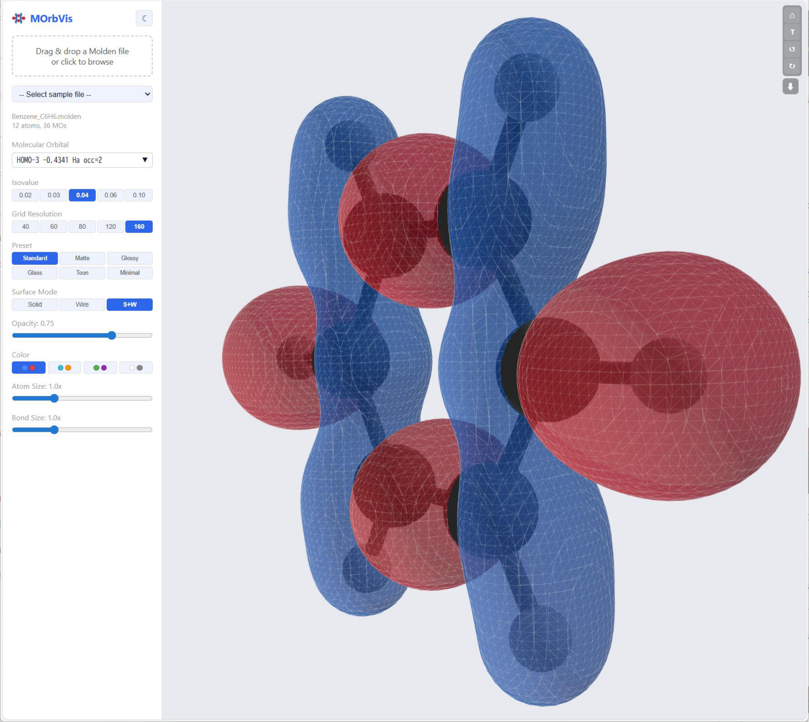

# MOrbVis

Molecular Orbital Visualization tool built with React + Three.js.
Reads Molden format files and renders isosurfaces of molecular orbitals in 3D.



## Features

- Parse Molden format files (.molden)
- 3D visualization of molecular orbitals with positive/negative isosurfaces
- Ball-and-stick molecular structure display
- Adjustable isovalue and grid resolution
- Multiple render presets (standard, matte, glossy, glass, toon, minimal)
- Color schemes and surface modes (solid, wireframe, solid+wire)
- Light/dark theme
- Computation progress indicator
- Export as PNG
- Desktop app via Tauri (Windows)

## Quick Start

```bash
npm install
npm run dev
```

Open http://localhost:5173 and load a Molden file.

## Desktop Build (Windows)

Requires [Rust](https://rustup.rs/) and WebView2 (included in Windows 10/11).

```bash
# Using the build script
tauri-build.bat

# Or manually
npx tauri build
```

Output is placed in `tauri-dist/`.

## Tech Stack

- **Frontend**: React, TypeScript, Three.js (via React Three Fiber)
- **Computation**: Web Worker for MO evaluation, marching cubes for isosurface extraction
- **Desktop**: Tauri v2

## Adding Sample Files

Place `.molden` files in `public/molden_files/` and list them in `public/molden_files/index.json`.

## License

[BSD-3-Clause](LICENSE)
